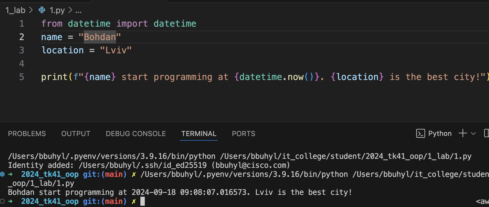
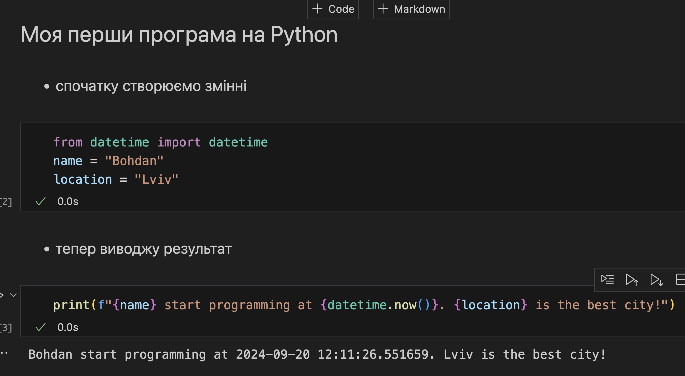

# Звіт до роботи №1
## Тема: _Вступ та оформлення робіт_
### Мета роботи: _Налаштувати локальне середовище розробки, створити Github репозиторій, оформлення робіт з використанням форматування Markdown_

---
### Виконання роботи
* Результати виконання завдань:
    1. Налаштували Visual Studio Code для роботи з Github;
    1. Створили репозиторій [ТК-41 ООП](https://github.com/BobasB/2024_tk41_oop/tree/main);
    1. Попрацювали з форматуванням Markdown та заповнили початкову сторінку;
    1. Почали оформляти першу роботу:
        - створили [файл з розширенням py](./1.py) та скопіювали тест програми та запустили програму.
        - Результат виконання програми представлений на скріншоті
        
    1. Створили [Пайтон ноутбук файл](1.ipynb), скопіювали код та запустили його, результат виконання наступний:
        
    1. Навчились запускати Пайтон програми.

* індивідуальне завдання з ChatGPT, отримано наступну відповідь.

---
### Висновок:
> у висновку потрібно відповісти на запитання:

- :question: Що зроблено в роботі;
- :question: Чи досягнуто мети роботи;
- :question: Які нові знання отримано;
- :question: Чи вдалось відповісти на всі питання задані в ході роботи;
- :question: Чи вдалося виконати всі завдання;
- :question: Чи виникли складності у виконанні завдання;
- :question: Чи подобається такий формат здачі роботи (Feedback);
- :question: Побажання для покращення (Suggestions);

---